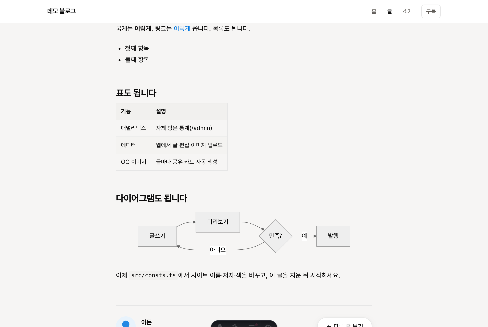
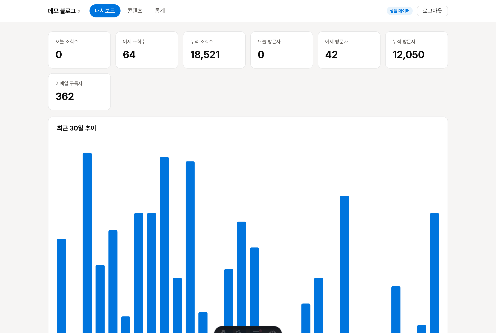
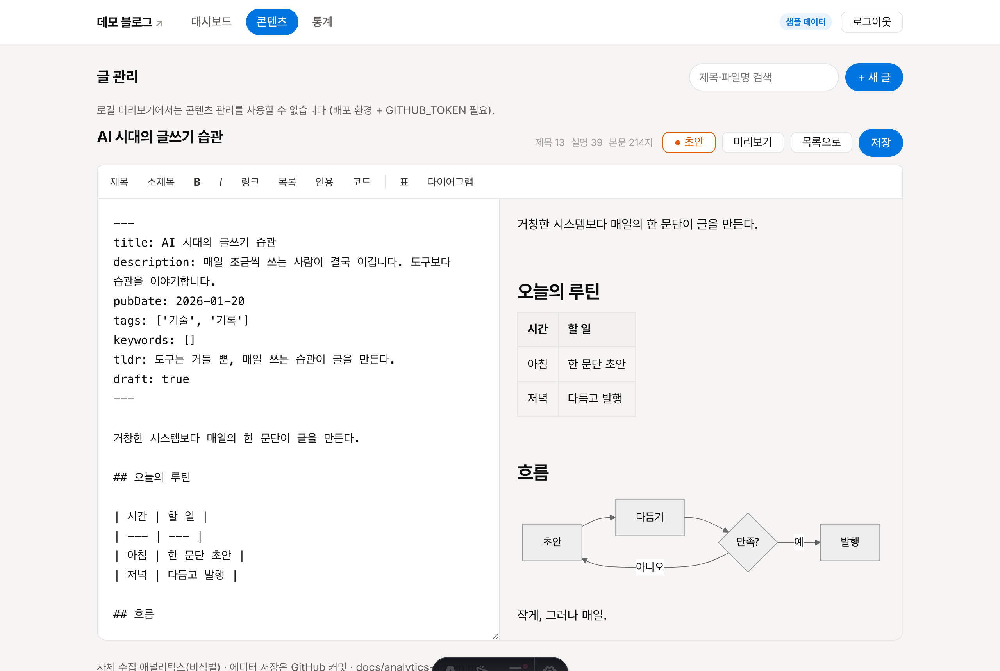

# Astro Blog Starter — 개인 블로그 + 관리자 대시보드

마크다운으로 글을 쓰면 게시되는 **초고속 정적 블로그**와, 방문 통계·웹 에디터·이미지 업로드·이메일 구독을 갖춘 **관리자 대시보드**를 **완전 무료로** 운영하는 템플릿입니다. (Astro + Cloudflare Pages)

> 🚀 **바로 시작:** 위의 **`Use this template`** 버튼으로 내 저장소를 만들고, **[SETUP.md](SETUP.md)** 를 따라 하세요. 코드를 몰라도 30~60분이면 배포됩니다.

## 🖼️ 미리보기

| 홈 | 글 (표·다이어그램 지원) |
|---|---|
|  |  |

| 관리자 대시보드 (자체 통계) | 웹 에디터 (실시간 미리보기) |
|---|---|
|  |  |

<sub>※ 위 화면은 예시 데이터입니다. `src/consts.ts`만 바꾸면 내 브랜드로 바뀝니다.</sub>

## ✨ 기능

- ⚡ **정적 블로그** — 마크다운으로 글쓰기, RSS·사이트맵 자동
- 🎨 미니멀 디자인 · 다크모드 · **모바일 최적화**
- 🔎 **SEO/GEO** — 구조화 데이터(JSON-LD)·`llms.txt`·글별 **OG 카드 자동생성**(제목 박힌 공유 이미지)
- 📊 **자체 방문 통계**(`/admin`) — 조회·방문자·유입경로·인기글, 개인정보 비식별
- ✍️ **웹 에디터** — 브라우저에서 편집, **이미지 드래그&드롭·붙여넣기**, 실시간 미리보기, **표·Mermaid 다이어그램**
- 🏷️ 카테고리 탭 · 태그 · 관련 글 추천
- 📬 **이메일 구독** 수집
- 🤖 **(선택) 콘텐츠 자동화** — 매일 소재 제안 → 다채널 초안 → 승인 발행 (Claude Code + 텔레그램). 👉 [automation/](automation/)
- 💸 **무료** — Cloudflare Pages + D1 무료 티어

## 🧱 기술 스택

Astro 5 · Cloudflare Pages Functions · D1(SQLite) · satori/resvg(OG 생성) · Pretendard/Inter

## 🖥️ 로컬 실행

```bash
npm install
npm run dev        # http://localhost:4321
```

## 📖 전체 설치·배포 가이드

👉 **[SETUP.md](SETUP.md)** — 복제 → 내 정보로 수정 → Cloudflare 배포 → 관리자/통계/에디터/구독 켜기 → 검색엔진 등록까지 단계별.

## 📁 구조 · 라이선스

`src/consts.ts` 한 곳에서 사이트 설정을 관리합니다. 구조는 [SETUP.md](SETUP.md) 참고.
[MIT License](LICENSE) — 자유롭게 쓰고 고치세요.
