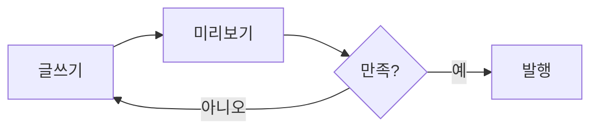

이 문장은 예시 본문입니다. 이 파일(`src/content/blog/2026-01-01-welcome.md`)을 지우고 첫 글을 쓰거나, 로그인 후 **/admin → 콘텐츠**에서 편집하세요.

## 마크다운 그대로 씁니다

굵게는 **이렇게**, 링크는 [이렇게](/about) 씁니다. 목록도 됩니다.

- 첫째 항목
- 둘째 항목

## 표도 됩니다

| 기능 | 설명 |
| --- | --- |
| 애널리틱스 | 자체 방문 통계(/admin) |
| 에디터 | 웹에서 글 편집·이미지 업로드 |
| OG 이미지 | 글마다 공유 카드 자동 생성 |

## 다이어그램도 됩니다

이제 `src/consts.ts`에서 사이트 이름·저자·색을 바꾸고, 이 글을 지운 뒤 시작하세요.
